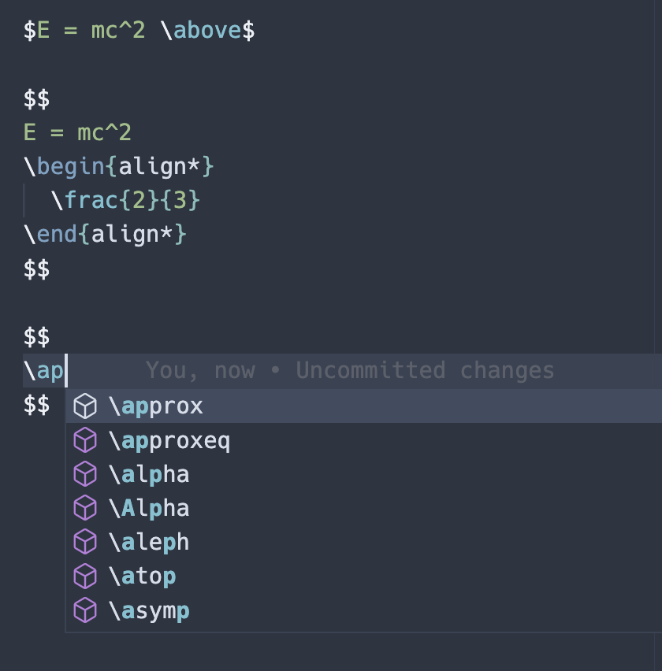
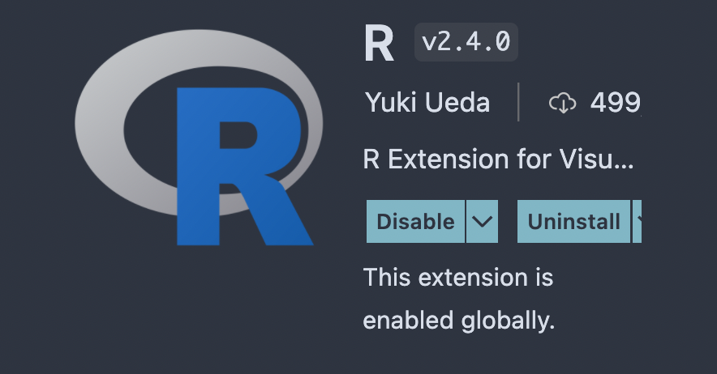
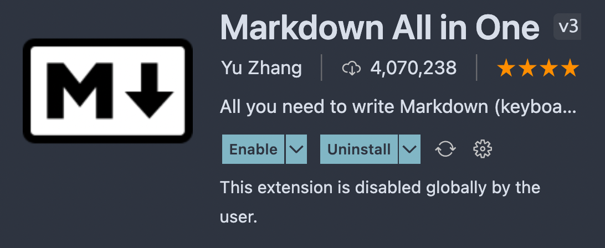
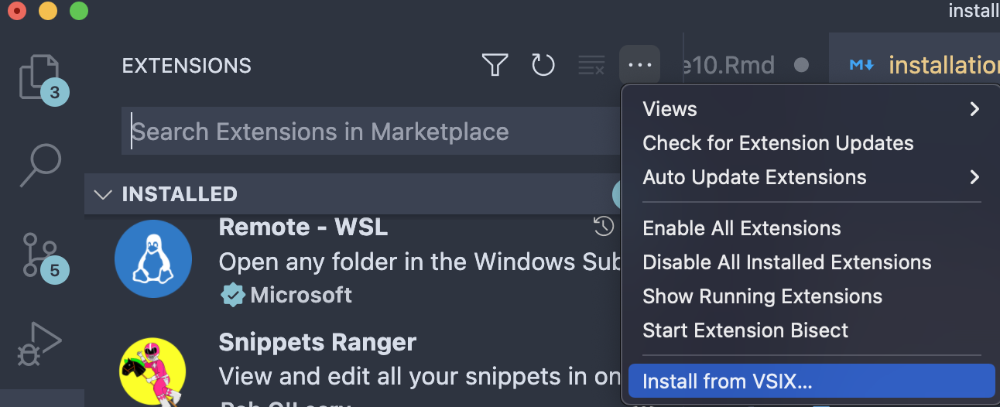

## R Markdown math highlighting and completion

Fork of Markdown All In One, but enables the extension to work
in R Markdown files. 
Provides syntax highlighting and code completion in inline and display
math blocks.
Inline math is contained within two `$`, math blocks
are between two pairs of `$$`.
Inline math highlighting only works while there are no spaces between the
math and the `$` on either end.

Example:

Math mode can be toggled with `cmd + m` on mac and 
`ctrl + m` on Windows.

## Installation

[Download the extension file](https://github.com/gustavkrist/vscode-markdown/raw/master/r-markdown-all-in-one-3.5.0.vsix)

Requires the vscode R extension

Disable Markdown All In One if you already have it installed

Then install the downloaded .vsix extension file.

Click extensions in the sidebar, then the three dots in the upper right
corner of the menu, then install from VSIX and locate the downloaded file.